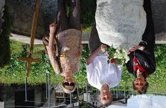

# 6: Image processing
06_Original


## Translation
A translation 2x3 floating point matrix `M` is used with the function
`cv2.warpAffine(img, M, (w, h))`.
```python
M = np.float32([[1, 0, 25], [0, 1, 50]])
shifted = cv2.warpAffine(image, M, (image.shape[1], image.shape[0]))
```

06_Shifted Down and Right


06_Shifted Up and Left


06_Shifted Down


## Rotation
To rotate an image we need a 2x3 rotation matrix.
```python
M = cv2.getRotationMatrix2D(center, 45, 1.0)
rotated = cv2.warpAffine(image, M, (w, h))
```

06_Rotated by 45 Degrees


06_Rotated by -90 Degrees


06_Rotated by 180 Degrees


## Reseizing
06_Resized by Width


06_Resized by Height


06_Resized via Function


## Flipping
Flipping an image can be done with the function `cv2.flip(img, dir)`.

06_Flipped Horizontally


06_Flipped Vertically



06_Flipped Horizontally & Vertically


## Cropping
Extracting an image region (cropping) can be achieved by using
the NumPy array slicing.
```
cropped = image[30:120, 240:335]
```

06_face_of_the_man


## Arithmetic
Testing basic arithmetic functions

06_2_Rectangle


06_2_Circle


06_2_AND


06_2_OR


06_2_XOR


06_2_NOT_rectangle


06_2_NOT_circle


## Masking
Using a mask to take only the most important part of the picture.

06_2_Square Mask applied to image


06_2_Circular Mask applied to image


## Splitting And Merging Channels

__Splitting the channels__

06_3_Red


06_3_Green


06_3_Blue


06_3_red


06_3_green


06_3_blue


