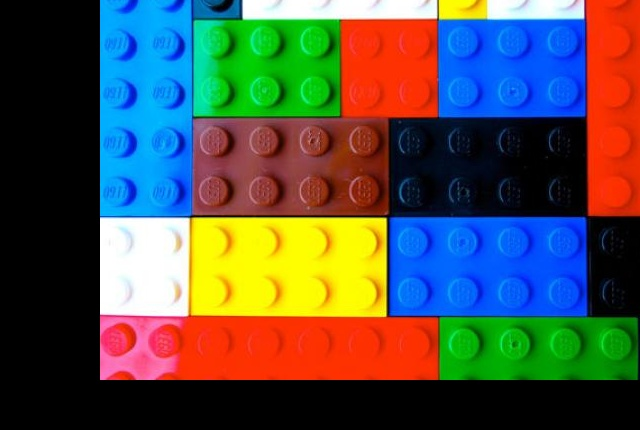
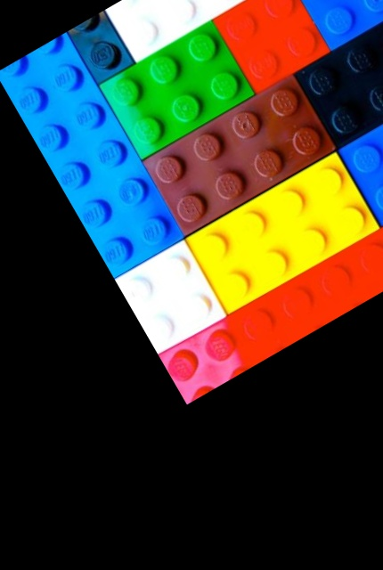
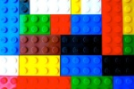
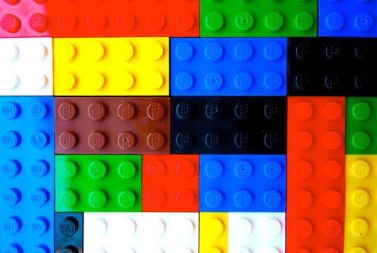
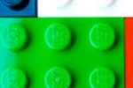
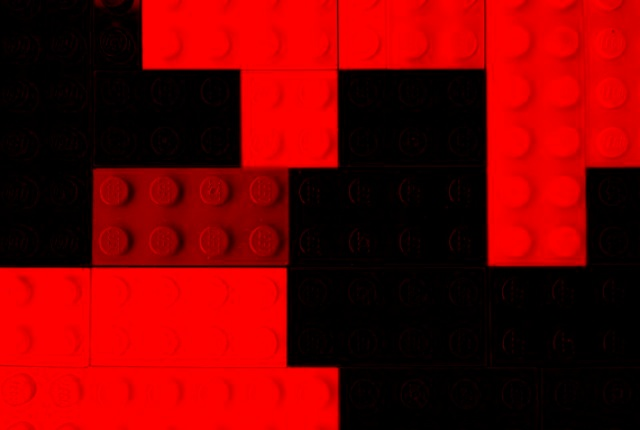
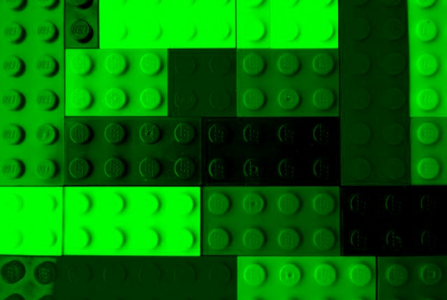
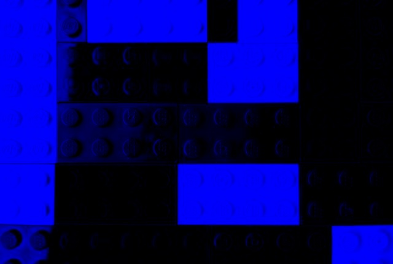

The 6th chapter is the image processing chapter, here's the base image that we will be using during the whole explaination.

# Translation
Translate the image from the given x, y values

`translate(img, 100, -50)`

# Rotation
Rotate the image around the given point from the given value.

`rotate(img, 150, 50, 30)`

# Resize
Resize the given image, if height isn't given or it is negative, it will keep the same ratio.

`resize(img, 150, 100)`

# Flipping
Flip the image in the given direction, possible values are :
        - v for vertical
        - h for horizontal
        - b for both

`flip(img, "v")`

# Crop
Crop the given image, from the start point to the end point.

`crop(img, 100, 50, 250, 150)`

# Spliting
Split the image into the diffrent color channel.
Ex :

