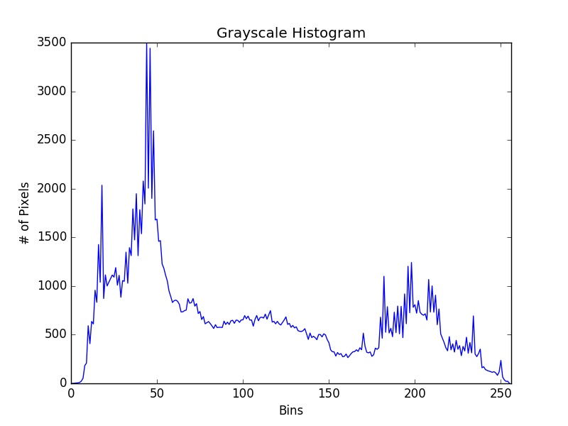
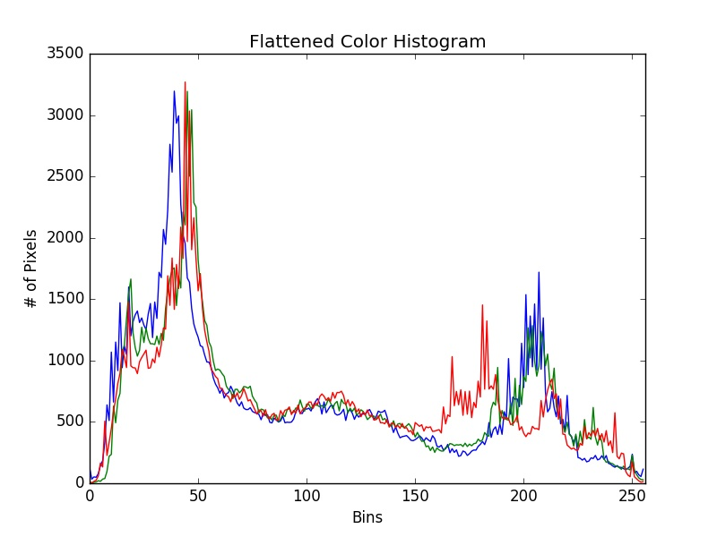
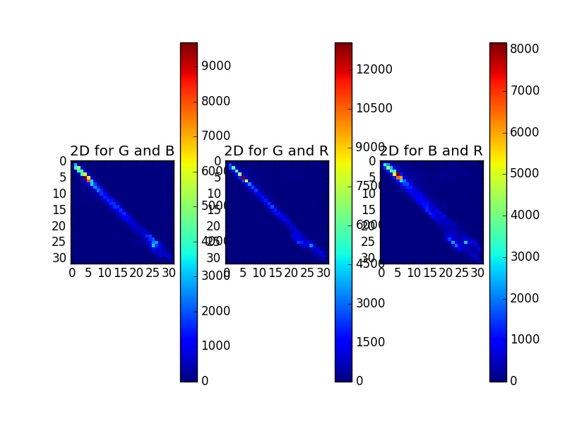
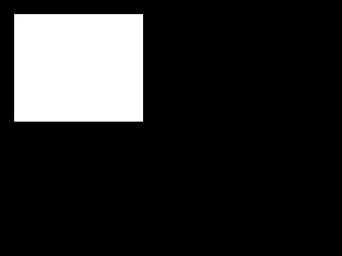
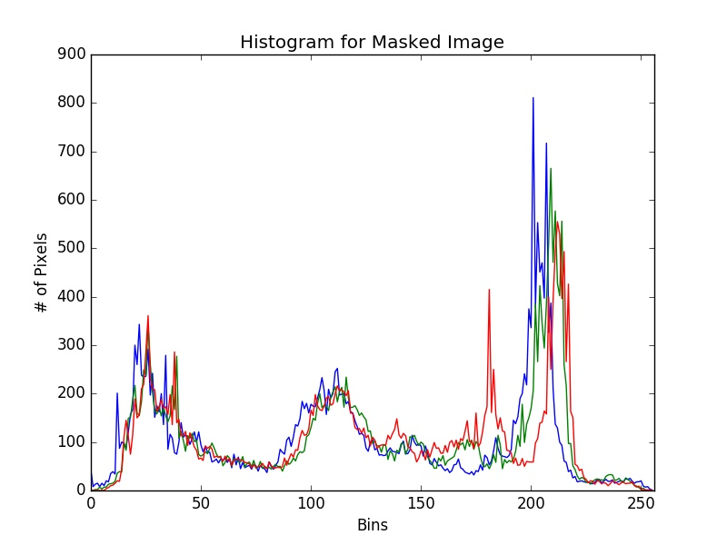

# Histograms
The chapter 7 is about the histograms, here are some exemples of what we can do with the following image :

# Gray Histogram
Here's the histogram of the image in gray :

# Color Histogram
Here's the histogram of the image in color :

# 2D Color Histogram
This histogram shows the combination of colors in the picture.

# Equalizer
Equalizing an image is finding the perfect contrast to use the most pixels.

# Histogram with mask
We can use a mask for the histogram, with the following mask, here's the histogram we get :

