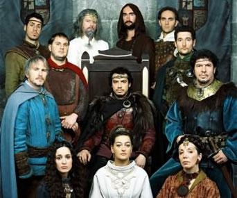
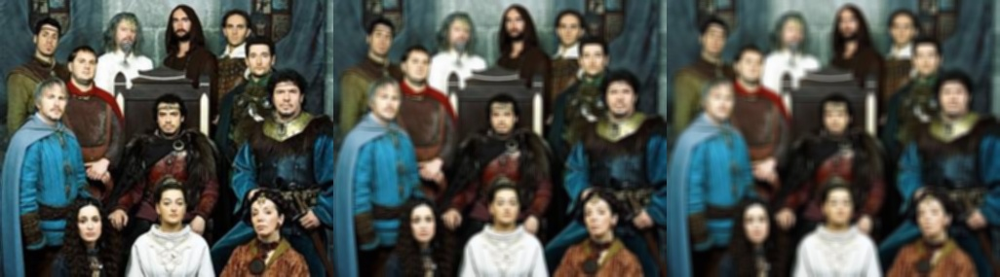
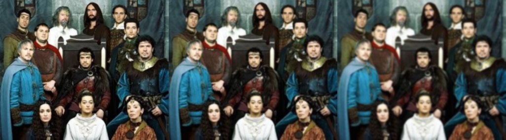
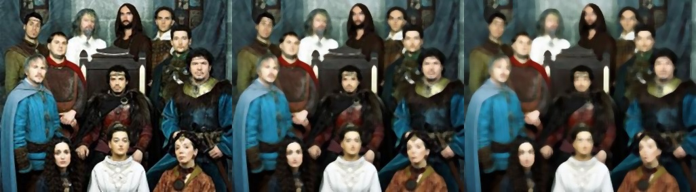
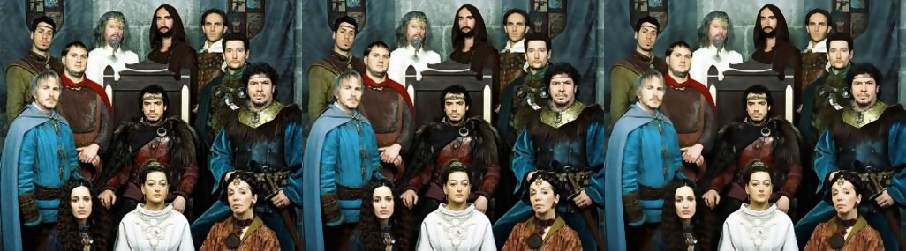

# Blur and Smooth

## Average Methode
Blur the given image with the given size with the average blur methode.

`blur_avrg(image, 3)
blur_avrg(image, 5)
blur_avrg(image, 7)`

## Gaussian Methode
Blur the given image with the given size with the gaussian blur methode.

`blur_gaus(image, 3)
blur_gaus(image, 5)
blur_gaus(image, 7)`

## Median Methode
Blur the given image with the given size with the median blur methode.

`blur_med(image, 3)
blur_med(image, 5)
blur_med(image, 7)`

## Bilateral Methode
Blur the given image with the given size with the blur_bi methode. Slower than the other methods

`blur_bi(image, 3, 15)
blur_bi(image, 5, 30)
blur_bi(image, 7, 50)`

