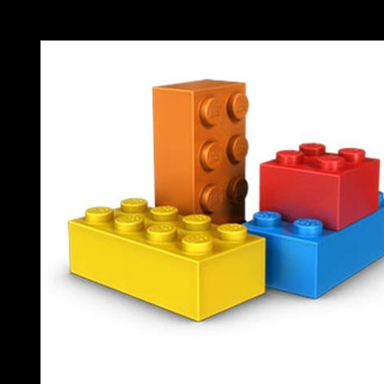
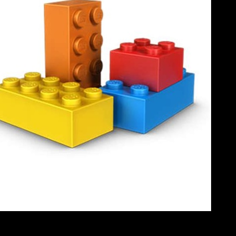
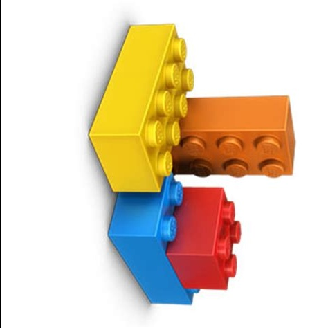
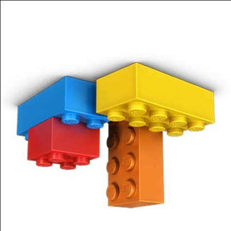

# Image processing
Original


## Translation
A translation 2x3 floating point matrix `M` is used with the function
`cv2.warpAffine(img, M, (w, h))`.
```python
M = np.float32([[1, 0, 50], [0, 1, 50]])
shifted = cv2.warpAffine(image, M, (image.shape[1], image.shape[0]))
```

Shifted_Down_and_Right



Shifted_Up_and_Left



Shifted_Down


## Rotation
To rotate an image we need a 2x3 rotation matrix.
```python
M = cv2.getRotationMatrix2D(center, 70, 1.0)
rotated = cv2.warpAffine(image, M, (w, h))
```

Rotated_by_70_Degrees


Rotated_by_-90_Degrees



Rotated_by_180_Degrees



## Reseizing
Resized_by_Width


Resized_by_Height


Resized_via_Function


## Flipping
Flipping an image can be done with the function `cv2.flip(img, dir)`.

Flipped_Horizontally


Flipped_Vertically


Flipped_Horizontally_&_Vertically


## Cropping
Extracting an image region (cropping) can be achieved by using
the NumPy array slicing.
```
cropped = image[40:220, 100:300]```

orange_lego


