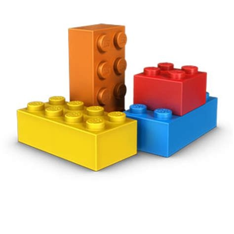
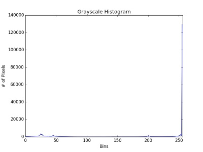
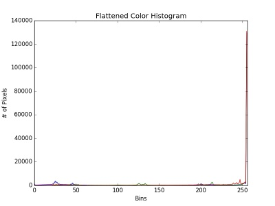
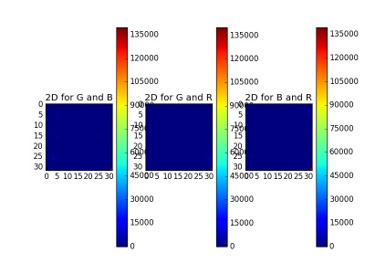
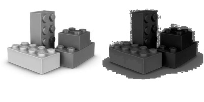
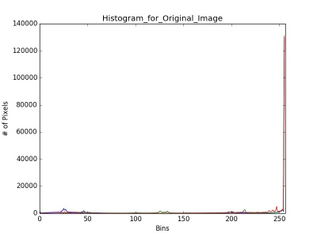
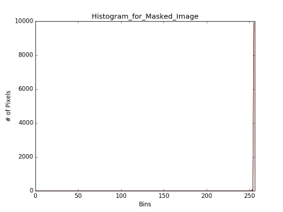

# Histogram
Original

## Grayscale histograms
Computing a grayscale histogram of the image

grayscale_histogram

## Color histograms
for each Red, Green, and Blue channel of the image

histogram_color

## Computing 2D
color histograms for each combination of Red, Green, and Blue channels

histogram_2D

## Equalization
*Left*: The original image.
*Right*: The image after applying histogram
equalizationcolor histograms for each combination of Red, Green, and Blue channels

equalizeHist

## Equalization
*Up*: Color histograms for the red, green,
and blue channels .
*Down*: Color histograms for the masked image

Histogram_for_Original_Image

Histogram_for_Masked_Image

